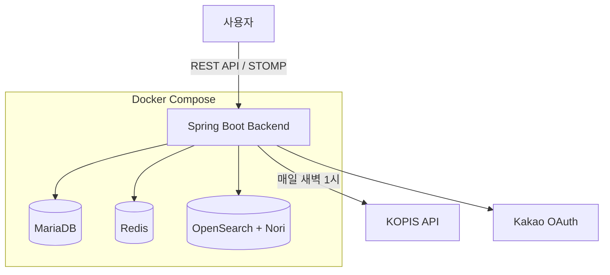
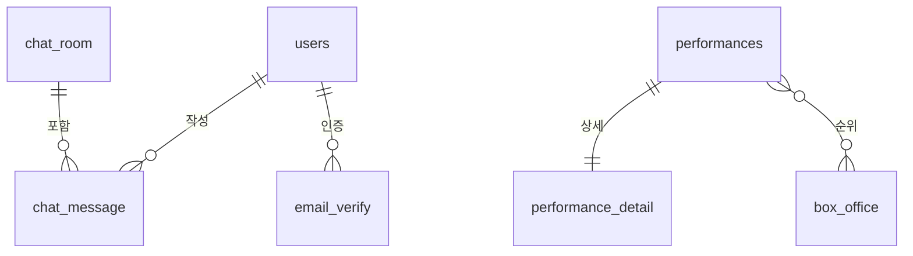

# 🎭 GrapeField 2.0

> **팀 프로젝트를 개선하여 재구축한 공연 정보 플랫폼**  
> 크롤링 → KOPIS API, 1000개 채팅방 → 6개로 단순화

## 🔗 바로 확인하기

| | 링크 | 설명 |
|---|---|---|
| 🌐 | [**서비스 바로가기**](https://grapefield-2.kro.kr/) | 실제 운영 중인 서비스 |
| 📋 | [**API 문서 (Swagger)**](https://grapefield-2.kro.kr/swagger-ui/index.html) | 전체 API 명세 확인 |
| 📊 | [**검색 성능 벤치마크**](https://grapefield-2.kro.kr/swagger-ui/index.html#/%EC%84%B1%EB%8A%A5%20%EB%B2%A4%EC%B9%98%EB%A7%88%ED%81%AC/compareSearch) | MariaDB vs OpenSearch 직접 실행 가능 |

---

## 📌 프로젝트 개요

국내 모든 공연 정보를 통합 검색하고, 장르별 실시간 채팅으로 정보를 공유하는 플랫폼

### 💭 개발 철학

> **"동작하는 단순함이 미완성 복잡함보다 낫다"**

GrapeField 1.0은 MSA, Kubernetes, Kafka로 설계했지만 완성하지 못했습니다.  
2.0은 Docker Compose, 모놀리식, 6개 채팅방으로 단순화하여 **실제로 동작하는 서비스**를 만들었습니다.

### 🎯 핵심 가치

- **완성도 우선**: 복잡한 미완성보다 단순한 완성
- **현실적 선택**: Oracle Cloud Free Tier 제약 속 최적화
- **기술 이해**: 제공받은 것이 아닌 직접 구축한 검색 엔진

---

## 🔄 v1.0 → v2.0 주요 개선

| 영역 | GrapeField 1.0 | GrapeField 2.0 | 개선 효과 |
|------|---------------|---------------|-----------|
| **데이터 수집** | Python 크롤링<br>(Interpark만) | KOPIS 공식 API | 일부 → 전국 공연 전체 |
| **채팅 구조** | 공연별 1000개 | 장르별 6개 | 서버 안정성 확보 |
| **인프라** | Kubernetes + Kafka + ELK | Docker Compose | 설정 복잡도 대폭 감소 |
| **검색 엔진** | Elasticsearch (제공받음) | OpenSearch (직접 구축) | 기술 이해도 향상 |

**자세한 설명**: [📚 Wiki - 기술 결정](https://github.com/J0a0J/Grapefield-2.0/wiki)

---

## ✨ 주요 기능

- 🎭 **공연 검색**: OpenSearch + Nori 한글 형태소 분석기
- 💬 **실시간 채팅**: WebSocket (STOMP) + Redis 세션 관리
- 📊 **박스오피스**: KOPIS 공식 순위 데이터
- 🔐 **소셜 로그인**: Kakao OAuth 2.0 + JWT
- 🤖 **자동 수집**: 매일 새벽 스케줄러로 5000+ 공연 동기화

---

## 🛠️ 기술 스택 상세

| 영역 | 기술 | 선정 이유 | 사용처 |
|------|------|----------|--------|
| **프레임워크** | Spring Boot 3.3.6 | 안정적인 LTS, SpringDoc 호환성 | REST API, WebSocket 서버 |
| **검색 엔진** | OpenSearch 2.19.4 + Nori | Elasticsearch 라이선스 이슈 회피, 한글 형태소 분석 | 공연 검색, 자동완성 |
| **세션 관리** | Redis | 서버 재시작 시 세션 유지, O(1) 조회 성능 | 채팅 접속자 관리 |
| **데이터 수집** | KOPIS API | 크롤링 대비 안정성, 전국 공연 100% 커버 | 매일 새벽 배치 수집 |
| **인증** | JWT + Kakao OAuth | 무상태 아키텍처, 소셜 로그인 편의성 | 로그인, 토큰 발급/검증 |
| **인프라** | Docker Compose | Kubernetes 복잡도 회피, 빠른 완성 | Redis, OpenSearch 관리 |

### Core
- **Java 17** | **Spring Boot 3.3.6** | **Gradle 8.5**

### Backend
- **Spring Security** + JWT (jjwt 0.12.6)
- **Spring Data JPA** (MariaDB)
- **Spring WebSocket** (STOMP)

### Infrastructure
- **Redis** - 채팅 세션 관리
- **OpenSearch 2.19.4** - 검색 엔진 + Nori
- **Docker Compose** - 컨테이너 관리

### External APIs
- **KOPIS API** - 공연예술통합전산망
- **Kakao OAuth 2.0** - 소셜 로그인

---

## 🏗️ 아키텍처


Docker Compose 기반 경량 아키텍처를 설계하고, OpenSearch를 별도 컨테이너로 분리하여 검색 성능을 독립적으로 최적화했습니다.

**상세 아키텍처**: [📚 Wiki - 시스템 아키텍처](https://github.com/J0a0J/Grapefield-2.0/wiki/시스템-아키텍처)

---

## ERD



공연 기본/상세 정보 1:1 분리로 목록 조회 최적화, 박스오피스는 Soft Link로 수집 실패 시 영향 없도록 설계

**상세 ERD**: [📚 Wiki - ERD](https://github.com/J0a0J/Grapefield-2.0/wiki/ERD)

---

## 📚 문서

### [Wiki 홈](https://github.com/J0a0J/Grapefield-2.0/wiki)

**기술 결정**
- [데이터 수집: 크롤링 → KOPIS API](https://github.com/J0a0J/Grapefield-2.0/wiki/%EA%B8%B0%EC%88%A0-%EA%B2%B0%EC%A0%95-%EB%8D%B0%EC%9D%B4%ED%84%B0-%EC%88%98%EC%A7%91-%EC%A0%84%ED%99%98)
- [채팅방 설계: 1000개 → 6개](https://github.com/J0a0J/Grapefield-2.0/wiki/%EA%B8%B0%EC%88%A0-%EA%B2%B0%EC%A0%95-%EC%B1%84%ED%8C%85%EB%B0%A9-%EC%84%A4%EA%B3%84)

**운영**
- [시스템 아키텍처](https://github.com/J0a0J/Grapefield-2.0/wiki/%EC%8B%9C%EC%8A%A4%ED%85%9C-%EC%95%84%ED%82%A4%ED%85%8D%EC%B2%98)
- [ERD](https://github.com/J0a0J/Grapefield-2.0/wiki/ERD)
- [API 명세](https://github.com/J0a0J/Grapefield-2.0/wiki/API-%EB%AA%85%EC%84%B8)

---

## 🔗 관련 링크

- **GrapeField 1.0 (팀 프로젝트)**: [GitHub](https://github.com/beyond-sw-camp/be12-fin-Catcher-GrapeField-BE)

---

## 🚀 빠른 시작

### 1. 환경 변수 설정
환경 변수 설정: [`.env.example`](.env.example) 참고
```bash
cp .env.example .env
# KOPIS_API_KEY, KAKAO_REST_API_KEY 등 입력
```

### 2. Docker 서비스 실행
```bash
docker-compose up -d  # Redis, OpenSearch 시작
```

### 3. 애플리케이션 실행
```bash
./gradlew bootRun
```

---

## ⚠️ KOPIS API 사용 시 주의

본 프로젝트는 KOPIS API를 사용하며, **출처 표기가 법적으로 필수**입니다.

```
출처: (재)예술경영지원센터 공연예술통합전산망(www.kopis.or.kr)
```

- API Key 발급: [KOPIS 오픈API](https://www.kopis.or.kr/por/cs/openapi/openApiList.do)
- 1인 1개 제한, 일일 호출 제한 있음

---

## 👤 개발자

**김지원** - Backend Developer

**연락**: [GitHub Issues](https://github.com/J0a0J/Grapefield-2.0/issues)

---

© 2026 김지원. All rights reserved.

본 프로젝트는 포트폴리오 용도로 제작되었습니다.
